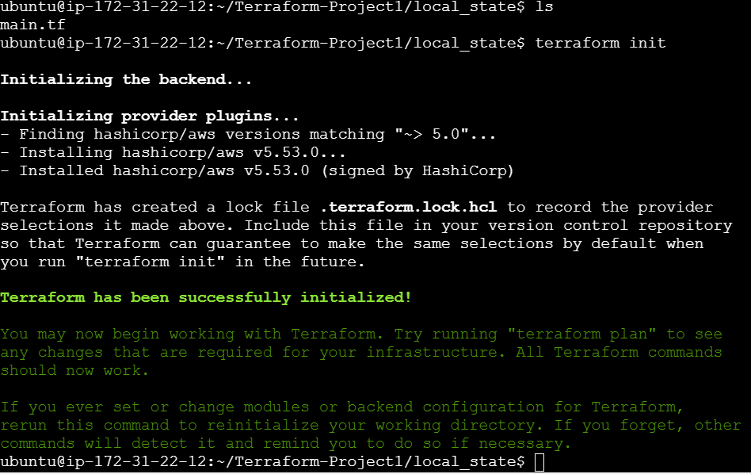
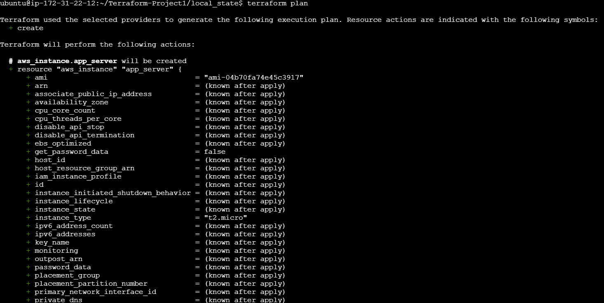
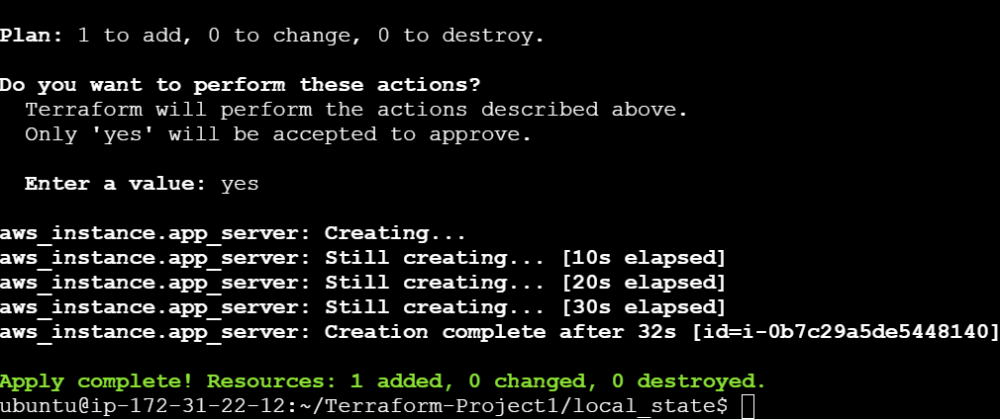
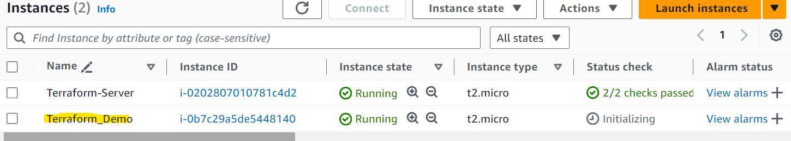

# EC2 Deployment with Terraform

This project demonstrates how to deploy an EC2 instance on AWS using Terraform. It uses HashiCorp's Terraform, an open-source Infrastructure as Code (IaC) tool, to automate the creation and management of AWS resources. The code launches an EC2 instance with basic configurations.

## Features

- Launches an EC2 instance with a specific AMI and instance type
- Adds a custom tag to the instance

## Prerequisites

- [Terraform](https://www.terraform.io/downloads.html) >= 1.2.0
- AWS account with programmatic access (Access key and secret key)
- IAM role with permissions to create EC2 instances

## Installation and Setup

1. Clone this repository:

    ```bash
    git clone https://github.com/SubodhBagde/Terraform-AWS-EC2-Setup.git
    ```

2. Navigate to the `local_state` directory:

    ```bash
    cd local_state
    ```

3. Initialize Terraform in your project:

    ```bash
    terraform init
    ```

4. Review the plan for creating resources:

    ```bash
    terraform plan
    ```

5. Apply the Terraform plan to deploy the EC2 instance:

    ```bash
    terraform apply
    ```

6. Confirm the action by typing `yes` when prompted.

## Configuration Details

- **Region**: `us-east-1`
- **AMI**: `ami-04b70fa74e45c3917` (Amazon Linux 2)
- **Instance Type**: `t2.micro`
- **Tag**: 
    - `Name`: `Terraform_Demo`

## Terraform Files

- **main.tf**: Defines the AWS provider, EC2 instance, and its configuration.
- **local_state**: Stores the Terraform state locally.

## Screenshots

| Screenshot 1 | Screenshot 2 |
| ------------ | ------------ |
|  |  |
| Screenshot 3 | Screenshot 4 |
|  |  |

## Contributing

Feel free to fork this repository and submit pull requests. For major changes, please open an issue first to discuss what you would like to change.

## Contact

If you have any questions or suggestions, feel free to contact me at [subodhbagde.dev@gmail.com].
